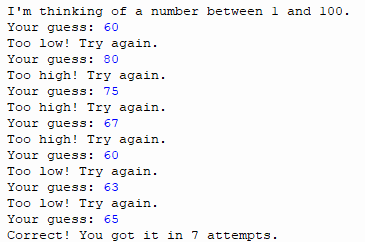
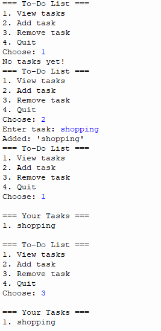

# Python-Stem-Portfolio
Python programming portfolio - Bishop's Stortford College STEM course
**Dexter Williamson**
**Bishop's Stortford College**
**Python for STEM**
**Year 12**

---

## About me 
[I am Dexter, i am in year 12 at the school of Bishop's Stortford College. I was born in the year of 2008 on october 10th. I love to play football and go to the gym. I study economics, geography and DT. My favourite subject is DT because i love making stuff, however personally i find a lot of interest in geography because i find it very enjoyable. ]

---

## Course Overview 
[During this course I have learnt the python fundamentals such as variables, input/output and data types. As well: 
- Control structures (Loops and conditions)
- Functions and modular code
- Data Structures(lists, dictionaires, tuples, sets)
- Validation and error handling
- File handling
- Object-orientinal programming(OOP)
- Versions control with Git and Github
- Working with Juypter Notebooks]

---

## Portfolio Projects 
| # | Project | Key Skills | Status |
|---|---|---|---|
| 1 | [Unit Converter](#) | Variables, funcitons, input/output| ✅Complete |
| 2 | [Number Guessing Game](#) | Loops, Conditional, Random | ✅Complete |
| 3 | [To-Do List](#) | Lists, Functions, Data structures | ✅Complete |
| 4 | [Calculator](#) | Validation, error handling | ✅Complete |
| 5 | [Multiplication Table](#) | loops | ✅Complete |
| 6 | [Database](#) |  Add data - crude operations, update, read | ✅Complete |

---

## Skills I Have Developed

**Programming Concepts**
- Writing clean, well-commented Python code
- Using functions to organise and reuse code 
- Handling user input safely with validation 

**Tools and Technologies** 
- Python 3 (Thonny IDE)
- Juypter Notebooks
- Git version control 
- Github for code sharing and portfolio management 
- Markdown for documentation

--- 

## Contact 

- **GitHub:** [DexterJW2008]
- **Email:** [26willid@bscmail.org]

## Project 1: Unit Converter 
[In this project I made a converter that changes units to different units, for exampe kilometers to miles.]

``` python
def km_to_miles(km):
    """Convert kilometres to miles."""
    miles = km * 0.621371
    return miles

def miles_to_km(miles):
    """Convert miles to kilometres."""
    km = miles / 0.621371
    return km


def show_menu():
    print("=== Unit Converter ===")
    print("1. Kilometres to Miles")
    print("2. Miles to Kilometres")
    print("3. Celsius to Fahrenheit")
    print("4. Fahrenheit to Celsius")

def main():
    show_menu()
    choice = input("Enter your choice (1-4): ")
    
    if choice == "1":
        km = float(input("Enter kilometres: "))
        result = km_to_miles(km)
        print(f"{km} km = {result:.2f} miles")
```
[This works by enter a number like 1 mile and the code times this number by the conversion and provides the new number]

## Project 2: Number Guessing Game
[In this project I created a game that has a number in it and the user has to guess what the number is, whilst gaining hints if they are to low or to high.]

``` python
import random

def play_game():
    """Play one round of the guessing game."""
    secret = random.randint(1, 100)
    attempts = 0
    
    print("I'm thinking of a number between 1 and 100.")
    
    while True:
        guess = int(input("Your guess: "))
        attempts += 1
        
        if guess < secret:
            print("Too low! Try again.")
        elif guess > secret:
            print("Too high! Try again.")
        else:
            print(f"Correct! You got it in {attempts} attempts.")
            break  # Exit the loop

play_game()


```

[This project works, the computer has a randome number between 1 and 100, and you the player enter a number, if it is to high you have to guess again and vice versa]

## Project 3: To do list
[This is a project that you can make a list of activities that you need to do as well as remove activites that you have done.]

``` python

def show_tasks(tasks):
    """Display all tasks with their numbers."""
    if len(tasks) == 0:
        print("No tasks yet!")
        return
    
    print("\n=== Your Tasks ===")
    for i, task in enumerate(tasks, start=1):
        print(f"{i}. {task}")
    print()

def add_task(tasks):
    """Add a new task to the list."""
    new_task = input("Enter task: ")
    tasks.append(new_task)
    print(f"Added: '{new_task}'")

def remove_task(tasks):
    """Remove a task by number."""
    show_tasks(tasks)
    number = int(input("Enter task number to remove: "))
    if 1 <= number <= len(tasks):
        removed = tasks.pop(number - 1)
        print(f"Removed: '{removed}'")
    else:
        print("Invalid number.")

def main():
    tasks = []
    
    while True:
        print("=== To-Do List ===")
        print("1. View tasks")
        print("2. Add task")
        print("3. Remove task")
        print("4. Quit")
        
        choice = input("Choose: ")
        
        if choice == "1":
            show_tasks(tasks)
        elif choice == "2":
            add_task(tasks)
        elif choice == "3":
            remove_task(tasks)
        elif choice == "4":
            print("Goodbye!")
            break

main()


```

[The program runs a simple loop that keeps a list called tasks, shows you a menu of options, and lets you either view the list, add a new item, or remove an existing one; each option calls a different function—show_tasks prints all tasks with numbers, add_task asks you for a new task and appends it to the list, and remove_task displays the tasks again and deletes the one whose number you enter—until you choose to quit, which breaks the loop and ends the program.]

## Project 4: Calculator

``` python
def main():
    menu = """
1. Volume of a cube
2. PED calculation
3. Percentage change
4. Quit"""
    
    while True:
        print(menu)
        while True:
            try:
                menuChoice = int(input('Enter a menu choice: '))
                break
            except ValueError:
                print("Please enter a number from the menu:")
        
        if menuChoice == 4:
            break
        elif menuChoice == 1:
            volumeCube()
        elif menuChoice == 2:
            ped()
        elif menuChoice == 3:
            percentageChange()
        else:
            print("Invalid choice. Please choose 1–4.")


def volumeCube():
    while True:
        try:
            length = float(input('Length: '))
            width = float(input('Width: '))
            height = float(input('Height: '))
            
            volume = length * width * height
            print(f'Volume is {volume} cubic units')
            break
        except ValueError:
            print('Only numbers may be entered')


def ped():
    print("Price Elasticity of Demand Calculator")

    q1 = float(input("Enter original quantity demanded: "))
    q2 = float(input("Enter new quantity demanded: "))
    p1 = float(input("Enter original price: "))
    p2 = float(input("Enter new price: "))

    # Percentage change in quantity
    pct_q = (q2 - q1) / q1

    # Percentage change in price
    pct_p = (p2 - p1) / p1

    ped_value = pct_q / pct_p

    print(f"PED: {ped_value}")


def percentageChange():
    original = float(input("Enter original value: "))
    new = float(input("Enter new value: "))

    pct_change = ((new - original) / original) * 100

    print(f"Percentage change: {pct_change}%")


main()
        

```


[Your calculator program runs a looped menu that lets the user choose between three different calculations—volume of a cube, price elasticity of demand (PED), and percentage change—and each option calls its own function to collect inputs, perform the math, and display the result; the menu keeps repeating until the user selects option 4 to quit, and the program also uses try/except blocks to prevent crashes when someone enters something that isn’t a number.]

## Prpject 5: Multiplication table 
[]

``` python

# Ask the user for a number
number = int(input("Enter a number to generate its multiplication table: "))

# Generate and display the multiplication table from 1 to 10
print(f"\nMultiplication Table for {number}:\n")
for i in range(1, 11):
    result = number * i
    print(f"{number} × {i} = {result}")

```


[Your multiplication‑table program is a simple script that asks the user for a number, then uses a `for` loop to multiply that number by every value from 1 to 10 and print each result in a clean, readable format; essentially, it takes one input and produces a full **multiplication table** by repeating the same calculation with different multipliers.]

## Project 6: Databse 
[This project is all about a databse that stores films, directors and my rating of it]

```

import sqlite3

def dbConnection():
    """Create connection and ensure table exists."""
    conn = sqlite3.connect('movie_list.db')
    cursor = conn.cursor()

    cursor.execute('''
        CREATE TABLE IF NOT EXISTS movielist (
            item_id INTEGER PRIMARY KEY AUTOINCREMENT,
            item_name TEXT NOT NULL,
            year INTEGER NOT NULL,
            director TEXT, 
            genre TEXT NOT NULL,
            rating INTEGER
        )
    ''')

    conn.commit()
    return conn, cursor


def insertDatawithParameters():
    """Add data to the database table."""
    query = '''INSERT INTO movielist (item_name, year, director, genre, rating)
               VALUES (?, ?, ?, ?, ?)'''

    item_name = input('Enter the movie name: ')
    year = int(input('Enter the year: '))
    director = input('Enter the director: ')
    genre = input('Enter the genre: ')
    rating = int(input('Enter your rating (1–10): '))

    conn, cursor = dbConnection()
    cursor.execute(query, (item_name, year, director, genre, rating))
    conn.commit()
    conn.close()

    print("Record was successfully saved")


def readDataBase():
    """Read and display all movies."""
    query = "SELECT * FROM movielist"

    conn, cursor = dbConnection()
    cursor.execute(query)
    results = cursor.fetchall()

    print("ID | Movie | Year | Director | Genre | Rating")
    print("-" * 60)

    for row in results:
        print(f"{row[0]} | {row[1]} | {row[2]} | {row[3]} | {row[4]} | {row[5]}")

    conn.close()


def removeItem():
    """Delete a movie by ID."""
    movie_id = int(input("Enter the ID of the movie to remove: "))

    conn, cursor = dbConnection()
    cursor.execute("DELETE FROM movielist WHERE item_id = ?", (movie_id,))
    conn.commit()
    conn.close()

    print("Movie removed (if ID existed).")


def updateItem():
    """Update a movie's rating."""
    movie_id = int(input("Enter the ID of the movie to update: "))
    new_rating = int(input("Enter the new rating: "))

    conn, cursor = dbConnection()
    cursor.execute("UPDATE movielist SET rating = ? WHERE item_id = ?", (new_rating, movie_id))
    conn.commit()
    conn.close()

    print("Movie updated (if ID existed).")


def menu():
    print("\nFilm List Ratings")
    print("------------------")
    print("1. Add item")
    print("2. Show items")
    print("3. Remove item")
    print("4. Update item")
    print("5. Quit\n")


def main():
    while True:
        menu()
        try:
            userChoice = int(input("Choose an option: "))
        except ValueError:
            print("Please enter a number.")
            continue

        if userChoice == 1:
            insertDatawithParameters()
        elif userChoice == 2:
            readDataBase()
        elif userChoice == 3:
            removeItem()
        elif userChoice == 4:
            updateItem()
        elif userChoice == 5:
            print("------------- End programme ---------")
            break
        else:
            print("Invalid option.")


main()


```

[Your film‑database project works by creating a small **SQLite database** on your computer, then giving you a menu that lets you **add films, view them, update ratings, or delete entries**. Each menu option calls a different function: the program first ensures the database and table exist, then **insertDatawithParameters** collects movie details from the user and saves them; **readDataBase** retrieves and prints all stored films; **removeItem** deletes a movie by its ID; and **updateItem** changes the rating of a selected film. The `main()` loop keeps showing the menu until you choose to quit, making it a simple but complete CRUD system (Create, Read, Update, Delete) for managing your personal movie list.]