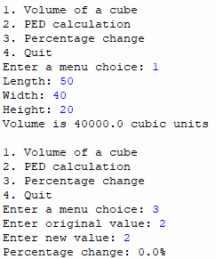
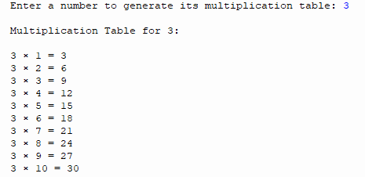
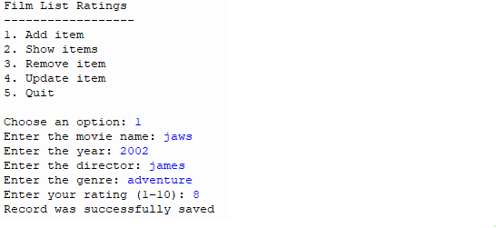

# Python-Stem-Portfolio
Python programming portfolio - Bishop's Stortford College STEM course
**Dexter Williamson**
**Bishop's Stortford College**
**Python for STEM**
**Year 12**

---

## About me 
[I am Dexter, i am in year 12 at the school of Bishop's Stortford College. I was born in the year of 2008 on october 10th. I love to play football and go to the gym. I study economics, geography and DT. My favourite subject is DT because i love making stuff, however personally i find a lot of interest in geography because i find it very enjoyable. ]

---

## Course Overview 
[During this course I have learnt the python fundamentals such as variables, input/output and data types. As well: 
- Control structures (Loops and conditions)
- Functions and modular code
- Data Structures(lists, dictionaires, tuples, sets)
- Validation and error handling
- File handling
- Object-orientinal programming(OOP)
- Versions control with Git and Github
- Working with Juypter Notebooks]

---

## Portfolio Projects 
| # | Project | Key Skills | Status |
|---|---|---|---|
| 1 | [Unit Converter](#) | Variables, funcitons, input/output| ✅Complete |
| 2 | [Number Guessing Game](#) | Loops, Conditional, Random | ✅Complete |
| 3 | [To-Do List](#) | Lists, Functions, Data structures | ✅Complete |
| 4 | [Calculator](#) | Validation, error handling | ✅Complete |
| 5 | [Multiplication Table](#) | loops | ✅Complete |
| 6 | [Database](#) |  Add data - crude operations, update, read | ✅Complete |
| 7 | [OOP Bank Account](#) | Classes, OOP principles | ✅ Complete |
| 8 | [Contact Notebook](#) | Jupyter Notebooks, data exploration | ✅ Complete |

---

## Skills I Have Developed

**Programming Concepts**
- Writing clean, well-commented Python code
- Using functions to organise and reuse code 
- Handling user input safely with validation 

**Tools and Technologies** 
- Python 3 (Thonny IDE)
- Juypter Notebooks
- Git version control 
- Github for code sharing and portfolio management 
- Markdown for documentation

--- 

## Contact 

- **GitHub:** [DexterJW2008]
- **Email:** [26willid@bscmail.org]

## Project 1: Unit Converter - Portfolio Projects
[In this project I made a converter that changes units to different units, for exampe kilometers to miles.]

``` python
def km_to_miles(km):
    return km * 0.621371

def miles_to_km(miles):
    return miles / 0.621371

def c_to_f(c):
    return (c * 9/5) + 32

def f_to_c(f):
    return (f - 32) * 5/9

def kg_to_pounds(kg):
    return kg * 2.20462

def pounds_to_kg(pounds):
    return pounds / 2.20462

def litres_to_pints(litres):
    # UK pints
    return litres * 1.75975

def pints_to_litres(pints):
    return pints / 1.75975


def get_number(prompt):
    """Safely get a numeric input from the user."""
    while True:
        try:
            return float(input(prompt))
        except ValueError:
            print("Invalid input. Please enter a number.")


def show_menu():
    print("\n=== Unit Converter ===")
    print("1. Kilometres to Miles")
    print("2. Miles to Kilometres")
    print("3. Celsius to Fahrenheit")
    print("4. Fahrenheit to Celsius")
    print("5. Kilograms to Pounds")
    print("6. Pounds to Kilograms")
    print("7. Litres to Pints")
    print("8. Pints to Litres")
    print("9. Exit")


def main():
    while True:
        show_menu()
        choice = input("Enter your choice (1-9): ")

        if choice == "1":
            km = get_number("Enter kilometres: ")
            print(f"{km} km = {km_to_miles(km):.2f} miles")

        elif choice == "2":
            miles = get_number("Enter miles: ")
            print(f"{miles} miles = {miles_to_km(miles):.2f} km")

        elif choice == "3":
            c = get_number("Enter Celsius: ")
            print(f"{c}°C = {c_to_f(c):.2f}°F")

        elif choice == "4":
            f = get_number("Enter Fahrenheit: ")
            print(f"{f}°F = {f_to_c(f):.2f}°C")

        elif choice == "5":
            kg = get_number("Enter kilograms: ")
            print(f"{kg} kg = {kg_to_pounds(kg):.2f} pounds")

        elif choice == "6":
            pounds = get_number("Enter pounds: ")
            print(f"{pounds} pounds = {pounds_to_kg(pounds):.2f} kg")

        elif choice == "7":
            litres = get_number("Enter litres: ")
            print(f"{litres} litres = {litres_to_pints(litres):.2f} pints")

        elif choice == "8":
            pints = get_number("Enter pints: ")
            print(f"{pints} pints = {pints_to_litres(pints):.2f} litres")

        elif choice == "9":
            print("Goodbye!")
            break

        else:
            print("Invalid choice. Please select 1-9.")


# Run the program
main()
```


[This works by enter a number like 1 mile and the code times this number by the conversion and provides the new number]

## Project 2: Number Guessing Game - Portfolio Projects
[In this project I created a game that has a number in it and the user has to guess what the number is, whilst gaining hints if they are to low or to high.]

``` python
import random

def get_number(prompt):
    """Safely get a numeric input from the user."""
    while True:
        try:
            return int(input(prompt))
        except ValueError:
            print("Invalid input. Please enter a number.")


def choose_difficulty():
    """Let the user pick a difficulty level."""
    print("\nChoose difficulty:")
    print("1. Easy (1–50)")
    print("2. Medium (1–100)")
    print("3. Hard (1–500)")

    while True:
        choice = input("Enter choice (1-3): ")
        if choice == "1":
            return 50
        elif choice == "2":
            return 100
        elif choice == "3":
            return 500
        else:
            print("Invalid choice. Please pick 1, 2, or 3.")


def play_game(max_number):
    """Play one round of the guessing game."""
    secret = random.randint(1, max_number)
    attempts = 0

    print(f"\nI'm thinking of a number between 1 and {max_number}.")

    while True:
        guess = get_number("Your guess: ")
        attempts += 1

        if guess < secret:
            print("Too low! Try again.")
        elif guess > secret:
            print("Too high! Try again.")
        else:
            print(f"Correct! You got it in {attempts} attempts.")
            return attempts  # return score


def main():
    best_score = None

    while True:
        max_number = choose_difficulty()
        attempts = play_game(max_number)

        # Update best score
        if best_score is None or attempts < best_score:
            best_score = attempts
            print("🎉 New best score!")
        
        print(f"Best score so far: {best_score} attempts")

        # Play again?
        again = input("\nDo you want to play again? (y/n): ").lower()
        if again != "y":
            print("Thanks for playing!")
            break


# Run the game
main()

```


[This project works, the computer has a randome number between 1 and 100, and you the player enter a number, if it is to high you have to guess again and vice versa]

## Project 3: To do list - Portfolio Projects
[This is a project that you can make a list of activities that you need to do as well as remove activites that you have done.]

``` python

import random

# ----------------------------
# GUESSING GAME SECTION
# ----------------------------

def get_number(prompt):
    """Safely get a number from the user."""
    while True:
        try:
            return int(input(prompt))
        except ValueError:
            print("Invalid input. Please enter a number.")


def choose_difficulty():
    print("\nChoose difficulty:")
    print("1. Easy (1–50)")
    print("2. Medium (1–100)")
    print("3. Hard (1–500)")

    while True:
        choice = input("Enter choice (1-3): ")
        if choice == "1":
            return 50
        elif choice == "2":
            return 100
        elif choice == "3":
            return 500
        else:
            print("Invalid choice.")


def play_guessing_game():
    best_score = None

    while True:
        max_number = choose_difficulty()
        secret = random.randint(1, max_number)
        attempts = 0

        print(f"\nI'm thinking of a number between 1 and {max_number}.")

        while True:
            guess = get_number("Your guess: ")
            attempts += 1

            if guess < secret:
                print("Too low!")
            elif guess > secret:
                print("Too high!")
            else:
                print(f"✅ Correct! You got it in {attempts} attempts.")

                if best_score is None or attempts < best_score:
                    best_score = attempts
                    print("🎉 New best score!")

                print(f"Best score: {best_score}")
                break

        again = input("Play again? (y/n): ").lower()
        if again != "y":
            break


# ----------------------------
# TASK MANAGER SECTION
# ----------------------------

tasks = []  # list of dictionaries


def show_tasks():
    if not tasks:
        print("No tasks yet.")
        return

    print("\nYour Tasks:")
    for i, task in enumerate(tasks):
        status = "✓" if task["done"] else " "
        print(f"{i + 1}. [{status}] {task['name']}")


def add_task():
    name = input("Enter task name: ")
    tasks.append({"name": name, "done": False})
    print("Task added!")


def mark_done():
    show_tasks()
    if not tasks:
        return

    try:
        num = int(input("Enter task number: "))
        if 1 <= num <= len(tasks):
            tasks[num - 1]["done"] = True
            print("Task marked as done!")
        else:
            print("Invalid number.")
    except ValueError:
        print("Enter a valid number.")


def task_menu():
    while True:
        print("\n=== Task Manager ===")
        print("1. Show Tasks")
        print("2. Add Task")
        print("3. Mark Task as Done")
        print("4. Back")

        choice = input("Choose: ")

        if choice == "1":
            show_tasks()
        elif choice == "2":
            add_task()
        elif choice == "3":
            mark_done()
        elif choice == "4":
            break
        else:
            print("Invalid choice.")


# ----------------------------
# MAIN MENU
# ----------------------------

def main():
    while True:
        print("\n=== Main Menu ===")
        print("1. Guessing Game")
        print("2. Task Manager")
        print("3. Exit")

        choice = input("Choose an option: ")

        if choice == "1":
            play_guessing_game()
        elif choice == "2":
            task_menu()
        elif choice == "3":
            print("Goodbye!")
            break
        else:
            print("Invalid choice.")


# Run program
main()

```


[The program runs a simple loop that keeps a list called tasks, shows you a menu of options, and lets you either view the list, add a new item, or remove an existing one; each option calls a different function—show_tasks prints all tasks with numbers, add_task asks you for a new task and appends it to the list, and remove_task displays the tasks again and deletes the one whose number you enter—until you choose to quit, which breaks the loop and ends the program.]

## Project 4: Calculator - Portfolio Projects

``` python
def main():
    menu = """
1. Volume of a cube
2. PED calculation
3. Percentage change
4. Quit"""
    
    while True:
        print(menu)
        while True:
            try:
                menuChoice = int(input('Enter a menu choice: '))
                break
            except ValueError:
                print("Please enter a number from the menu:")
        
        if menuChoice == 4:
            break
        elif menuChoice == 1:
            volumeCube()
        elif menuChoice == 2:
            ped()
        elif menuChoice == 3:
            percentageChange()
        else:
            print("Invalid choice. Please choose 1–4.")


def volumeCube():
    while True:
        try:
            length = float(input('Length: '))
            width = float(input('Width: '))
            height = float(input('Height: '))
            
            volume = length * width * height
            print(f'Volume is {volume} cubic units')
            break
        except ValueError:
            print('Only numbers may be entered')


def ped():
    print("Price Elasticity of Demand Calculator")

    q1 = float(input("Enter original quantity demanded: "))
    q2 = float(input("Enter new quantity demanded: "))
    p1 = float(input("Enter original price: "))
    p2 = float(input("Enter new price: "))

    # Percentage change in quantity
    pct_q = (q2 - q1) / q1

    # Percentage change in price
    pct_p = (p2 - p1) / p1

    ped_value = pct_q / pct_p

    print(f"PED: {ped_value}")


def percentageChange():
    original = float(input("Enter original value: "))
    new = float(input("Enter new value: "))

    pct_change = ((new - original) / original) * 100

    print(f"Percentage change: {pct_change}%")


main()
        

```



[The calculator program runs a looped menu that lets the user choose between three different calculations—volume of a cube, price elasticity of demand (PED), and percentage change—and each option calls its own function to collect inputs, perform the math, and display the result; the menu keeps repeating until the user selects option 4 to quit, and the program also uses try/except blocks to prevent crashes when someone enters something that isn’t a number.]

## Prpject 5: Multiplication table - Portfolio Projects
[]

``` python

# Ask the user for a number
number = int(input("Enter a number to generate its multiplication table: "))

# Generate and display the multiplication table from 1 to 10
print(f"\nMultiplication Table for {number}:\n")
for i in range(1, 11):
    result = number * i
    print(f"{number} × {i} = {result}")

```



[The multiplication‑table program is a simple script that asks the user for a number, then uses a `for` loop to multiply that number by every value from 1 to 10 and print each result in a clean, readable format; essentially, it takes one input and produces a full **multiplication table** by repeating the same calculation with different multipliers.]

## Project 6: Databse - Portfolio Projects
[This project is all about a databse that stores films, directors and my rating of it]

```

import sqlite3

def dbConnection():
    """Create connection and ensure table exists."""
    conn = sqlite3.connect('movie_list.db')
    cursor = conn.cursor()

    cursor.execute('''
        CREATE TABLE IF NOT EXISTS movielist (
            item_id INTEGER PRIMARY KEY AUTOINCREMENT,
            item_name TEXT NOT NULL,
            year INTEGER NOT NULL,
            director TEXT, 
            genre TEXT NOT NULL,
            rating INTEGER
        )
    ''')

    conn.commit()
    return conn, cursor


def insertDatawithParameters():
    """Add data to the database table."""
    query = '''INSERT INTO movielist (item_name, year, director, genre, rating)
               VALUES (?, ?, ?, ?, ?)'''

    item_name = input('Enter the movie name: ')
    year = int(input('Enter the year: '))
    director = input('Enter the director: ')
    genre = input('Enter the genre: ')
    rating = int(input('Enter your rating (1–10): '))

    conn, cursor = dbConnection()
    cursor.execute(query, (item_name, year, director, genre, rating))
    conn.commit()
    conn.close()

    print("Record was successfully saved")


def readDataBase():
    """Read and display all movies."""
    query = "SELECT * FROM movielist"

    conn, cursor = dbConnection()
    cursor.execute(query)
    results = cursor.fetchall()

    print("ID | Movie | Year | Director | Genre | Rating")
    print("-" * 60)

    for row in results:
        print(f"{row[0]} | {row[1]} | {row[2]} | {row[3]} | {row[4]} | {row[5]}")

    conn.close()


def removeItem():
    """Delete a movie by ID."""
    movie_id = int(input("Enter the ID of the movie to remove: "))

    conn, cursor = dbConnection()
    cursor.execute("DELETE FROM movielist WHERE item_id = ?", (movie_id,))
    conn.commit()
    conn.close()

    print("Movie removed (if ID existed).")


def updateItem():
    """Update a movie's rating."""
    movie_id = int(input("Enter the ID of the movie to update: "))
    new_rating = int(input("Enter the new rating: "))

    conn, cursor = dbConnection()
    cursor.execute("UPDATE movielist SET rating = ? WHERE item_id = ?", (new_rating, movie_id))
    conn.commit()
    conn.close()

    print("Movie updated (if ID existed).")


def menu():
    print("\nFilm List Ratings")
    print("------------------")
    print("1. Add item")
    print("2. Show items")
    print("3. Remove item")
    print("4. Update item")
    print("5. Quit\n")


def main():
    while True:
        menu()
        try:
            userChoice = int(input("Choose an option: "))
        except ValueError:
            print("Please enter a number.")
            continue

        if userChoice == 1:
            insertDatawithParameters()
        elif userChoice == 2:
            readDataBase()
        elif userChoice == 3:
            removeItem()
        elif userChoice == 4:
            updateItem()
        elif userChoice == 5:
            print("------------- End programme ---------")
            break
        else:
            print("Invalid option.")


main()


```


[The film‑database project works by creating a small **SQLite database** on your computer, then giving you a menu that lets you **add films, view them, update ratings, or delete entries**. Each menu option calls a different function: the program first ensures the database and table exist, then **insertDatawithParameters** collects movie details from the user and saves them; **readDataBase** retrieves and prints all stored films; **removeItem** deletes a movie by its ID; and **updateItem** changes the rating of a selected film. The `main()` loop keeps showing the menu until you choose to quit, making it a simple but complete CRUD system (Create, Read, Update, Delete) for managing your personal movie list.]


## Project 7 OOP bank account - Portfolio Projects

```
class BankAccount:
    def __init__(self, owner, balance=0):
        self.owner = owner
        self.balance = balance

    def deposit(self):
        try:
            amount = float(input("Enter amount to deposit: £"))
            if amount > 0:
                self.balance += amount
                print("Deposit successful!")
            else:
                print("Amount must be positive.")
        except:
            print("Invalid input.")

    def withdraw(self):
        try:
            amount = float(input("Enter amount to withdraw: £"))
            if amount > self.balance:
                print("Not enough money.")
            elif amount <= 0:
                print("Amount must be positive.")
            else:
                self.balance -= amount
                print("Withdrawal successful!")
        except:
            print("Invalid input.")

    def show_balance(self):
        print("Owner:", self.owner)
        print("Balance: £", round(self.balance, 2))


# ✅ Savings account (extension)
class SavingsAccount(BankAccount):
    def __init__(self, owner, balance=0, interest_rate=5):
        super().__init__(owner, balance)
        self.interest_rate = interest_rate

    def apply_interest(self):
        interest = self.balance * (self.interest_rate / 100)
        self.balance += interest
        print("Interest added!")


def get_number(prompt):
    """Safe number input for setup"""
    while True:
        try:
            return float(input(prompt))
        except:
            print("Please enter a valid number.")


def main():
    name = input("Enter your name: ")
    balance = get_number("Enter starting balance: £")

    print("\nChoose account type:")
    print("1. Normal Account")
    print("2. Savings Account")

    choice = input("Choose: ")

    if choice == "2":
        account = SavingsAccount(name, balance)
    else:
        account = BankAccount(name, balance)

    while True:
        print("\n1. Deposit")
        print("2. Withdraw")
        print("3. Check balance")
        print("4. Apply interest")
        print("5. Exit")

        option = input("Choose: ")

        if option == "1":
            account.deposit()
        elif option == "2":
            account.withdraw()
        elif option == "3":
            account.show_balance()
        elif option == "4":
            if isinstance(account, SavingsAccount):
                account.apply_interest()
            else:
                print("This is not a savings account.")
        elif option == "5":
            print("Goodbye!")
            break
        else:
            print("Invalid choice.")


main()
```


[This works by giving you multiple options to deposit money into your account and then you can view your account and see the added amount of money, or withdraw from the account.]

## Portfolio 8 - Contact book with file saivngs - Portfolio Projects

```
import os

FILENAME = "contacts.txt"


def load_contacts():
    """Load contacts from file."""
    contacts = []
    if os.path.exists(FILENAME):
        with open(FILENAME, "r") as f:
            for line in f:
                parts = line.strip().split(",")
                if len(parts) == 2:
                    contacts.append({
                        "name": parts[0],
                        "phone": parts[1]
                    })
    return contacts


def save_contacts(contacts):
    """Save contacts to file."""
    with open(FILENAME, "w") as f:
        for c in contacts:
            f.write(f"{c['name']},{c['phone']}\n")
    print("✅ Contacts saved.")


def add_contact(contacts):
    """Add a new contact."""
    name = input("Name: ").strip()
    phone = input("Phone: ").strip()

    if name == "" or phone == "":
        print("❌ Name and phone cannot be empty.")
        return

    contacts.append({"name": name, "phone": phone})
    save_contacts(contacts)


def view_contacts(contacts):
    """Display contacts."""
    if not contacts:
        print("No contacts saved.")
        return

    print("\n=== Contacts ===")
    for i, c in enumerate(contacts, 1):
        print(f"{i}. {c['name']} - {c['phone']}")


def get_choice():
    """Safe menu choice input."""
    while True:
        choice = input("Choose: ")
        if choice in ["1", "2", "3"]:
            return choice
        else:
            print("Invalid choice. Enter 1, 2 or 3.")


def main():
    contacts = load_contacts()
    print(f"Loaded {len(contacts)} contact(s).")

    while True:
        print("\n1. View contacts")
        print("2. Add contact")
        print("3. Exit")

        choice = get_choice()

        if choice == "1":
            view_contacts(contacts)
        elif choice == "2":
            add_contact(contacts)
        elif choice == "3":
            print("Goodbye!")
            break


# Run program
main()
```


[you can add contacts to and create a filling system, the code asks what number and you have options to view or add contacts, creating a notebook, with files, which you can add to and view.
